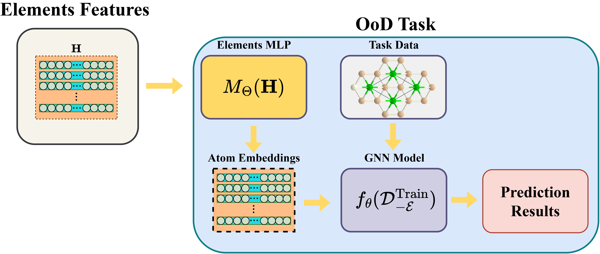

# Beyond Training Data: Enhancing ML-Based Formation Energy Predictions with Elemental Features

This repository contains the code for the paper "Beyond Training Data: Enhancing ML-Based Formation Energy Predictions with Elemental Features" by Hamed Mahdavi, Vasant Honavar, and Dane Morgan.
## Overview

This project investigates how elemental features can significantly improve machine learning models' ability to predict formation energies of materials, particularly for compounds containing elements not seen during training. By incorporating chemical knowledge through elemental descriptors, our models achieve remarkable out-of-distribution (OOD) generalization capabilities.

## Key Features

- **OOD Generalization**: Models can accurately predict formation energies for compounds containing completely unseen elements
- **Elemental Feature Integration**: Uses chemical properties of elements to enhance prediction capabilities
- **Multiple Model Architectures**: Implementations of SchNet and MACE with our elemental feature enhancement
- **Robust Performance**: Maintains accuracy even when up to 10% of elements are excluded from training data

## Results

Our approach demonstrates significant improvements in OOD scenarios:

- Models using elemental features perform nearly as well as models trained on complete datasets
- Performance remains strong even when predicting compounds with multiple unseen elements
- Substantial improvement over baseline models that lack access to elemental features


## Technical Approach

Rather than using randomly initialized element embeddings, we:

1. Incorporate a comprehensive set of 54 elemental features from the periodic table
2. Process these features through a neural network to create chemically meaningful embeddings
3. Feed these embeddings into state-of-the-art graph neural network architectures (SchNet, MACE)

This approach allows the model to leverage chemical similarities between elements, enabling accurate predictions even for previously unseen elements.


*Figure: Our Elements MLP architecture processes elemental features through a neural network to create chemically meaningful embeddings.*

## Usage

```bash
# Clone the repository
git clone https://github.com/hamedmahdavi72/OOD-formation-energy
cd OOD-formation-energy

# Set up environment
conda env create -f environment.yaml
conda activate materials-ml

# Run experiments with different configurations
# OOD experiments with excluded elements
python code/evaluate.py --experiment_type ood-list --excluded_elements_list 51 11 34 44 65 39 89 35

# OOD experiments with IID training
python code/evaluate.py --experiment_type ood-list-train-iid --excluded_elements_list 92 48 19 22 77 68 52 20

# OOD experiments with IID training and scaling
python code/evaluate.py --experiment_type ood-list-train-iid_scaled --excluded_elements_list 70 69 93 38 70 67 65 21 23 39

# Run batch experiments using the provided script
bash run-ood-experiments.sh
```

Parameters:
- `--experiment_type`: Choose from `ood-list`, `ood-list-train-iid`, or `ood-list-train-iid-scaled`
- `--excluded_elements_list`: Atomic numbers of elements to exclude from training
- `--model_type`: Select model architecture (default: mace)
- `--results_directory`: Directory to save results

## Dataset

We use the Materials Project formation energy dataset (`matbench_mp_e_form`), containing 132,752 inorganic compound structures with DFT-calculated formation energies. 